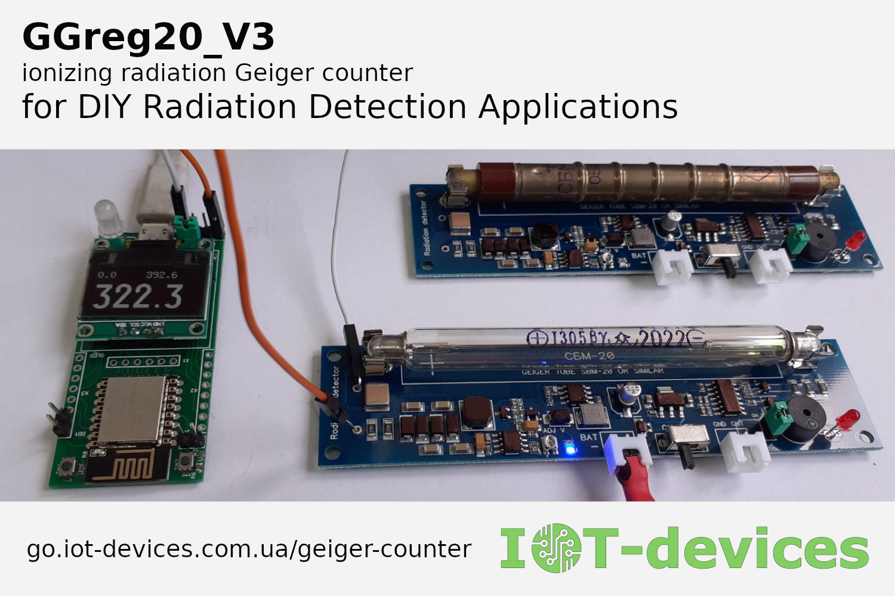

# DIY Geiger Counter Module GGreg20_V3
DIY Geiger Counter Module with Pulsed Output GGreg20_V3

## Easy Links
### Unique Vendor ID
[go.iot-devices.com.ua/ggreg20_v3](https://go.iot-devices.com.ua/ggreg20_v3)
### User Friendly ID
[go.iot-devices.com.ua/geiger-counter](https://go.iot-devices.com.ua/geiger-counter)
### Related Radiation Detection Applications Links:
[go.iot-devices.com.ua/high-voltage-converter](https://go.iot-devices.com.ua/high-voltage-converter) <=>
[go.iot-devices.com.ua/dcdc_3v3_400v_v1](https://go.iot-devices.com.ua/dcdc_3v3_400v_v1)

[go.iot-devices.com.ua/geiger-counter-emulator](https://go.iot-devices.com.ua/geiger-counter-emulator) <=>
[go.iot-devices.com.ua/gcemu20_v1](https://go.iot-devices.com.ua/gcemu20_v1)

## Driver Libraries and Code Examples

### GGreg20_V3 compatible firmware for Flipper Zero
> If GGreg20_V3 is used with a J305 Geiger tube, no changes are required at all, i.e. you can simply compile this example. 
In other cases (for example, if GGreg20_V3 is used with an SBM20 tube), you need to change the conversion factor for the tube from 0.0081 to the appropriate one (for SBM20 - 0.0057) before compiling the firmware in the source code of this example.

[flipperzero-geigercounter](https://github.com/nmrr/flipperzero-geigercounter)

### Arduino / C++
[IoT-devices GGreg20_V3 Arduino Driver Library](https://github.com/iotdevicesdev/GGreg20_V3)

### Home Assistant and ESPHome
#### ESPHome Devices
[GGreg20_V3 page at devices.esphome.io](https://devices.esphome.io/devices/IoT-devices-GGreg20-V3)
#### ESP8266 Example / YAML
[GGreg20_V3 under Home Assistant with ESPHome setup example](https://github.com/iotdevicesdev/ggreg20-v3-homeassistant-esphome-example#ggreg20_v3-under-home-assistant-with-esphome-setup-example)
#### ESP32 Example / YAML
[GGreg20_V3 with generic ESP32 under Home Assistant with ESPHome setup example](https://github.com/iotdevicesdev/GGreg20_V3-ESP32-HomeAssistant-ESPHome#ggreg20_v3-with-generic-esp32-under-home-assistant-with-esphome-setup-example)
#### Raspberry Pi Pico W Example / YAML
[Raspberry Pi Pico W Geiger counter using GGreg20_V3 and ESPHome example](https://github.com/iotdevicesdev/RPi-Pico-W_GGreg20_V3-ESPHome)

### ThingSpeak / YAML
[GGreg20_V3 Radiation Sensor Node with ThingSpeak REST-API for Home Assistant](https://github.com/iotdevicesdev/GGreg20_V3-Kyiv-Radiation-Sensor-ThingSpeak-HomeAssistant#ggreg20_v3-radiation-sensor-node-with-thingspeak-rest-api-for-home-assistant)
### Tasmota / Berry
[GGreg20_V3 and ESP32 Tasmota Firmware driver](https://github.com/iotdevicesdev/ggreg20-v3-tasmota-esp32-driver#ggreg20_v3-and-esp32-tasmota-firmware-driver)
### NodeMCU / Lua
[GGreg20_V3 NodeMCU firmware Lua code example](https://github.com/iotdevicesdev/ggreg20-v3-nodemcu-lua-example#ggreg20_v3-nodemcu-firmware-lua-code-example)
### Wokwi / C++
[GGreg20_V3 radiation counter simulator for Arduino UNO powered by WOKWI](https://github.com/iotdevicesdev/ggreg20-v3-arduino-uno-wokwi-simulator#ggreg20_v3-radiation-counter-simulator-for-arduino-uno-powered-by-wokwi)

## Technical Notes
[Technical note on voltage level matching for GGreg20_V3 and 5V MCU](https://iot-devices.com.ua/en/technical-note-on-voltage-level-matching-for-ggreg20v3-and-5v-mcu/)

[DIY Geiger counter: GGreg20_V3 and ESP12.OLED connection diagram](https://iot-devices.com.ua/en/diy_geiger_counter_ggreg20_v3_and_esp12-oled_wiring_diagram_en/)

[Geiger counter GGreg20_V3: maximum radiation that can be measured](https://iot-devices.com.ua/en/maximum-radiation-that-can-be-measured-by-geiger-counter-ggreg20_v3-en/)

[Geiger counter GGreg20_V3: supply voltage range of the Geiger counter module](https://iot-devices.com.ua/en/technical_note_supply_voltage_range_geiger_counter_ggreg20_v3/)

[Technical note on bug fixes in ESPHome firmware for ESP32 regarding GPIO and interrupt handler settings modes](https://iot-devices.com.ua/en/technical-note-on-esp32-gpio-interrupt-esphome-bug-fixes/)

[Technical note: Geiger counter at low temperatures – the work of a DIY module](https://iot-devices.com.ua/en/technical_note_performance_of_diy_geiger_counter_ggreg20_v3_at_low_-temperatures/)

[UV test of Geiger tubes J305](https://iot-devices.com.ua/en/uv-test-of-the-j305-geiger-tubes/)

[Technical note: How to calculate the conversion factor for Geiger tube SBM20](https://iot-devices.com.ua/en/technical-note-how-to-calculate-the-conversion-factor-for-geiger-tube-sbm20/)

[Geiger-Muller tubes: Comparison of SBM20, J305 and LND712](https://iot-devices.com.ua/en/comparison-of-geiger-muller-tubes-sbm20-j305-and-lnd712/)

## Projects
### Tags and Topics
[Hackaday GGreg20_V3 tag](https://hackaday.io/projects?tag=ggreg20_v3)

[GitHub GGreg20_V3 topic](https://github.com/search?q=topic%3Aggreg20-v3&type=repositories)

[Hackaday 'Geiger Counter' tag](https://hackaday.io/projects?tag=Geiger%20counter)

[GitHub 'geiger-counter' topic](https://github.com/search?q=topic%3Ageiger-counter&type=repositories)

### Search
[Hackaday GGreg20_V3 search](https://hackaday.io/search?term=ggreg20_v3)

[Instructables GGreg20_V3 search](https://www.instructables.com/search/?q=ggreg20_v3&projects=all)

[Tindie Blog GGreg20_V3 search](https://blog.tindie.com/?s=GGreg20_V3)

[IFIXIT GGreg20_V3 search](https://www.ifixit.com/Search?query=ggreg20_v3)

